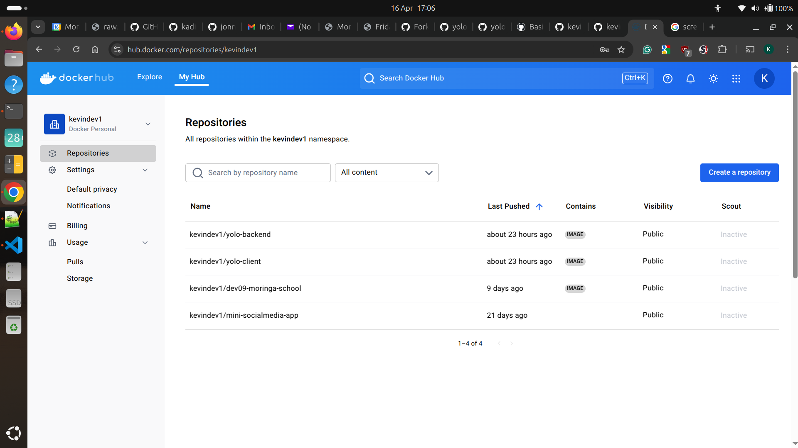

```markdown
# A BASIC MICRO SERVICE WEB APP WITH NODE.JS, MONGODB, AND DOCKER COMPOSE

## Choice of the Base Image

- **Why `node:14` Specifically?**  
  Version 14 of Node.js is stable and widely supported, offering reliability for most applications. It's also lightweight and optimized for performance, balancing compatibility and resource usage.

- **Why Alpine?**  
  Alpine Linux is a super lightweight image, designed for minimal resource consumption. It reduces the final image size significantly, which is especially useful in production environments where large images can slow down deployment and increase storage costs.

---

## Dockerfile Directives

### **1. `FROM`**
- **Purpose:** Specifies the base image for the container.

### **2. `WORKDIR`**
- **Purpose:** Sets the working directory inside the container. Any subsequent file operations (e.g., `COPY`, `RUN`) will happen relative to this directory.

### **3. `COPY`**
- **Purpose:** Copies files from the host machine into the container.

### **4. `RUN`**
- **Purpose:** Executes commands in the container's shell during build time (not runtime).

### **5. `EXPOSE`**
- **Purpose:** Documents which port the application listens on. This helps in configuring the container's networking but does not actually publish the port.

### **6. `CMD`**
- **Purpose:** Specifies the default command to run when the container starts. Unlike `RUN`, it executes during runtime.

---

## Docker-compose Networking

Networking in the Docker Compose file is key to enabling smooth communication among the microservices. Here's a breakdown:

### **Custom Bridge Network (`app-net`)**
The file defines a network named `app-net`, with the following characteristics:
- **Name:** The network is explicitly named `app-net` to identify it easily across containers and configurations.
- **Driver:** A `bridge` driver is used, which is the default network driver in Docker. It ensures containers connected to the network can communicate directly using container names as hostnames.
- **Attachable:** The `attachable: true` directive allows external containers to dynamically join the network if needed, enabling flexibility in network expansion.
- **IPAM (IP Address Management):**
  - **Subnet:** The custom subnet `172.20.0.0/16` provides a range of IP addresses for containers within the network.
  - **IP Range:** Specifies `172.20.0.0/16` for allocating IPs. This ensures controlled and predictable IP assignment for containers.

---

### **How Services Use the Network**
Each service (`yolo-client`, `yolo-backend`, and `app-ip-mongo`) is connected to the `app-net` network:
- Containers on the same network can communicate with each other by using their container names as hostnames.
  - For example, the backend (`yolo-backend`) can connect to the MongoDB service (`app-ip-mongo`) by addressing it as `app-mongo` instead of needing an IP address.
- Networking makes interdependencies seamless, such as when `yolo-client` depends on `yolo-backend`.

---

## Docker-compose Volume

In the Docker Compose file, the `volumes` section is used to persist data and ensure that it's retained even if the container is removed or recreated.

### **Workflow Summary**
1. **Volume Initialization:** Docker automatically creates the `app-mongo-data` volume when the Compose file is executed (`docker-compose up`).
2. **Data Management:** MongoDB writes and reads data from `/data/db`, which is backed by the `app-mongo-data` volume.
3. **Persistence on Host:** Data in the volume persists in the host system's Docker-managed location, ensuring reliability during container lifecycle changes.

---

This setup ensures that your database remains functional, even if the container is replaced or updated. 

---

## Git Workflow 

- **Forked and cloned** the repository locally.

- **Ran the application locally** to ensure it works successfully.

- **Merged** the `revert-25-master` branch into the `master` branch.

- **Used semantic versioning** for the Docker images with each commit.

- **Built Docker images** for the microservices and pushed them to DockerHub using proper naming conventions.

- **Tested the application locally** using Docker Compose, verifying that microservices were properly networked.

- **Debugged MongoDB connection issues**, ensuring database functionality and persistence.
```


## DockerHub Screen Shot

